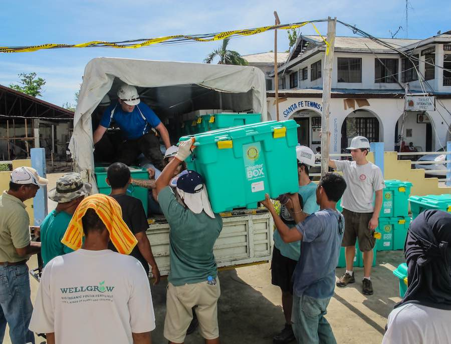
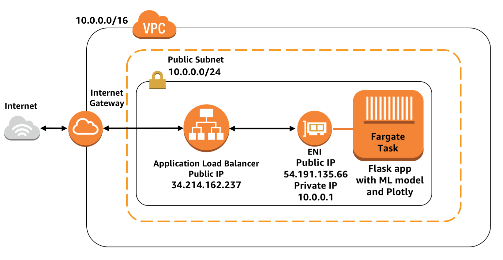

# Udacity's Disaster Response Project 
## Introduction


Source: [Figure-Eight](https://www.figure-eight.com/dataset/combined-disaster-response-data/)

Following a catastrophe typically disaster response organizations receive millions of messages from multiple sources like social media, news, direct communication from impacted area. This is also the moment that they have the least capacity to handle such volume of messages and filter those that are the most urgent.

According to [FigureEight](https://www.figure-eight.com), it's common that only one in every thousand messages is relevant for those disaster response organizations. In addition, usually each disaster response organization is responsible for helping with a specific part of the problem (e.g. one is responsible for solving the problem of supplying water, other for distributing medical supplies, etc.). Hence, after filtering messages, each part is contacted and the work is coodinated manually.

- The idea of the project is to develop a ML model to classify disaster response messages. This could potentially accelerate response to catastrophes by routing responses to appropriate organization automatically. 

The project is based on the datasets provided by Figure Eight [[1]](https://www.figure-eight.com/datasets/)


## Technologies used
Pipelines for pre-processing the text messages and inference were created using [Scikit-Learn](https://scikit-learn.org/stable/), [XGBoost](https://xgboost.ai/) and [NLTK](https://www.nltk.org/). There were some experimental attempts with BERT using the [Scikit-Learn BERT Wrapper](https://github.com/charles9n/bert-sklearn), but due to the size of the model weren't implemented in the final app. Hyperparameter optimization using Bayesian methods were also implemented with [Optuna](https://optuna.org/) (with Tree-structured Parzen Estimators, TPE).


For serving the model a Flask server was configured with Plotly for visualizations. The model was packed into a Docker container and deployed serverlessly in [AWS Fargate](https://aws.amazon.com/fargate/). For creating the necessary resources in AWS, a [CloudFormation](https://aws.amazon.com/cloudformation/) template was created.

For more explanation about how the data was prepared, which models were used, which hyperparameters, and more please refer to the [notebooks](./notebooks). 


## How to run it
If you just want to deploy the project into your AWS Account, first configure your [AWS CLI](https://docs.aws.amazon.com/cli/latest/userguide/cli-chap-configure.html) and then use CloudFormation to create all resources and deploy the app.

Just run:

```sh
$ git clone https://github.com/marcelokscunha/projects.git

$ cd projects/DisasterResponse

$ aws cloudformation create-stack --stack-name disasters-app --template-body file://deploy_artifacts/cfn-fargate-disasterservice.yml --capabilities CAPABILITY_IAM

$ aws cloudformation wait stack-create-complete --stack-name disasters-app && aws cloudformation describe-stacks --stack-name disasters-app --query 'Stacks[0].Outputs[0].OutputValue'

"http://disas-Publi-XXXXXXXXXXXX-XXXXXXXXXX.us-east-2.elb.amazonaws.com"
```

Open the output URL:


Configuring and behind the scenes:


If you want to customize for your case, in the [`deploy_artifacts`](../deploy_artifacts) folder there's a Dockerfile and a CloudFormation template.

You can [build the Docker image](https://docs.docker.com/get-started/part2/) and push it to your [DockerHub](https://hub.docker.com/) repository or [ECR Repository](https://aws.amazon.com/ecr/). Then, just deploy with the CloudFormation template modify to use your Docker image Repository.

The default architecture deployed with the CloudFormation template:



## Delete AWS resources
To delete the created resources (and avoid unnecessary costs) in AWS just run:
```sh
$ aws cloudformation delete-stack --stack-name disasters-app
```

## Costs for running app
The costs are described in [Fargate pricing](https://aws.amazon.com/fargate/pricing/), [ALB pricing](https://aws.amazon.com/elasticloadbalancing/pricing/) and [Free tier](https://aws.amazon.com/free). 

For the default configurations showed (with free tier) the cost will be ~0.025 USD/hour (18 USD/month).

## Possible improvements (out of the scope of this project)
- Export the database file to an actual database, in a separate VM (e.g. RDS)
- Break the app into microservices, with an API for the ML model (e.g. with SageMaker)
- Modify BERT's head and test it
- Optimize hyperparameters for longer, with more models (e.g. LightGBM, CatBoost, BERT, etc.)
- Shrink Docker container size (import only necessary libraries in requirements.txt)
- Add Service Auto Scaling in Fargate and use Spot for cost savings