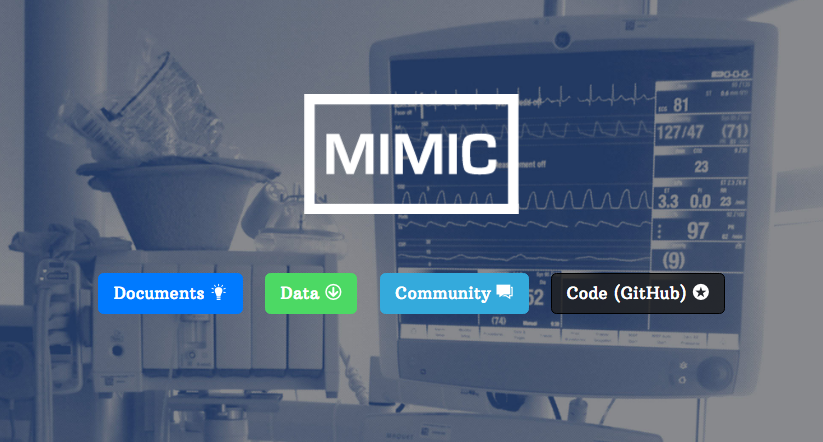
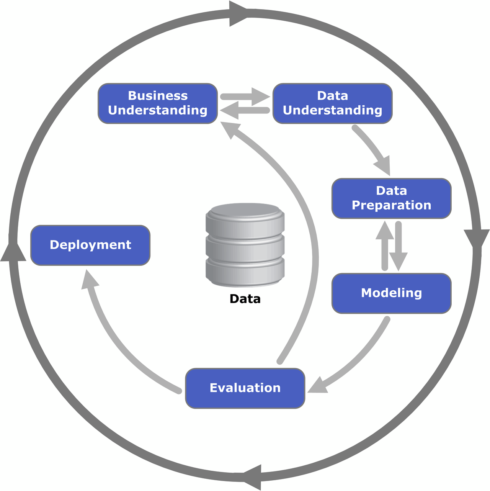

# CRISP-DM on the MIMIC-3 Dataset
## Introduction

The MIMIC-III dataset is awell known resource in the research community comprising of health-related data associated with over 60K admissions of patients who stayed in critical care units of the Beth Israel Deaconess Medical Center, Boston, Massachusetts, between 2001 and 2012. The dataset is is public and freely available, provided by the MIT Laboratory of Computational Physiology (LCP).

## Motivation

The idea of the project is to apply the CRISP-DM (Cross-Industry Standard Process for Data Mining) process in the context of Healthcare, more specifically for Intensive Care Units (ICUs). By being more data-driven we could rapidly improve the treatments and the healthcare system as a whole (not just with ML models with predictive power but also provide healthcare professionals more qualitative evidence for supporting clinical decisions).

## Project Structure

The project is structured following the methodology described in CRISP-DM:

This process can be broken into 6 main phases:
1. Business Understanding
2. Data Understanding
3. Data Preparation
4. Modeling
5. Evaluation
6. Deployment

For more information of each of the phases, please check the Jupyter notebooks. The [first notebook](./0_CRISM_Business_Data.ipynb) focus on the first 3 steps of CRISP-DM while the [last notebook](./1-CRISP_Model_Deployment.ipynb) focus on the last 3. The specific file of [scikit_learn_mimic.py](./scikit_learn_mimic.py) is related to the phases of training and deploying of the model in production as an REST API.

## Technologies used
In order to prepare the data, I used the data provided by [MIT LPC with AWS](https://aws.amazon.com/blogs/big-data/perform-biomedical-informatics-without-a-database-using-mimic-iii-data-and-amazon-athena/) that was in an [Amazon S3](https://aws.amazon.com/s3/) bucket (stored in optimized [Apache Parquet](https://parquet.apache.org/) format) and performed SQL queries with [Amazon Athena](https://aws.amazon.com/athena/) without having to provision a database. For visualization and manipulating data I used a Jupyter notebook hosted in [Amazon SageMaker](https://aws.amazon.com/sagemaker/). 

For making SQL queries in Athena from the Jupyter notebook, I used a library called [AWS Wrangler](https://github.com/awslabs/aws-data-wrangler), making it very easy to interact with Athena. In the notebook I also used several useful libraries like [Missingno](https://github.com/ResidentMario/missingno) for completeness of data, [WordCloud](https://github.com/amueller/word_cloud) for ploting interesting visualizations of text, and common libraries like Pandas, MatPlotLib, Numpy, Scipy, etc.

Pipelines for pre-processing health data from patients and inference were created using [Scikit-Learn](https://scikit-learn.org/stable/). A simple pipeline Imputer for NaNs values, Standard Scaler, Logistic Regression model was created and trained with cross validation.

 In the SageMaker notebook instance first created and trained the model locally and then trained and deployed the model in the SageMaker managed training and hosting infrastructure.

For creating all the necessary resources in AWS, the [CloudFormation](https://aws.amazon.com/cloudformation/) template provided by AWS and MIT was used.

## Summary of results
After training the model locally, without any hyperparameter optimization, nor testing other models other features, the average Area Under Receiver Operator Characteristic Curve (AUROC) over 5 folds was: 0.62

Given the simplicity of this model, one could say we have much to explore here and improve it by creating new features, testing other algorithms and hyperparameters!

## How to run it
If you just want to deploy the project into your AWS Account, [follow the instreuctions in the AWS blog post](https://aws.amazon.com/blogs/big-data/perform-biomedical-informatics-without-a-database-using-mimic-iii-data-and-amazon-athena/) (just read and click on the AWS CloudFormation `Create Stack` button)

## Remember to delete AWS resources
To delete the created resources just go to the AWS CloudFormation console, select the MIMIC-III stack and click on `Delete Stack`.

## Possible improvements (out of the scope of this project)
- Create new features with the MIMIC-III dataset
- Try other models
- Try other hyperparmeters (with some Hyperparameter Tuning technique, like GridSearch, Bayesian Optimization, etc.)
- Perform some feature selection (correlation analysis, check feature importances, explanability with [Shapley values](https://en.wikipedia.org/wiki/Shapley_value))
- Analysis class imbalances (and perform under/over sampling accordingly or generate synthetic data with some technique like [SMOTE](https://imbalanced-learn.readthedocs.io/en/stable/generated/imblearn.over_sampling.SMOTE.html))
- Add Auto Scaling in the SageMaker enpoint
- Create a ML pipeline for automating the whole process of data preparation, modeling, evaluation and deployment (with AirFlow, KubeFlow, StepFunctions)

## Acknowledgments:

I’d like to recognize the work of Prof. med. Thomas Ganslandt and Kim Hee from the Heinrich-Lanz-Center for Digital Health (HLZ) of the Medical Faculty Mannheim and Heidelberg University as well as Alistair Johnson, the research scientist at the Massachusetts Institute of Technology and all other contributors to the MIT-LCP GitHub repositories who have provided multiple useful examples. My idea here was to spread their work and also somehow extend it with a few other visualizations and showing how to integrate with AWS cloud components.

For more information on the work developed by MIT and other universities that collaborated, [check their repository](https://github.com/MIT-LCP/mimic-code).