# Udacity's Sparkify Capstone Project
## Introduction

In this project a classification model is developed to predict whether a customer will churn.

Sparkify is a fictitious music streaming service with lots of users. Users can play their favorite songs, create playlist, add friends, like/dislike songe, amoung other actions and the service has a free tier that plays advertisements and a premium tier which offers additional functionalities and is ad-free. Users can upgrade or downgrade their subscription plan any time, but also cancel it.

We want our model to predict if a customer will churn so that the company can act in advance and avoid losing customers. The data provided is from interactions that users have with the Sparkify app, containing multiple information, from like which action the user has performed (play song, add friend, cancel plan, go to home page, which song was listened, which artist, which device he/she is using the app, etc.).

Two datasets were available, one tiny subset (128MB) for local development and another full dataset (12GB).

The locations of the datasets were:

- Mini dataset: 

`s3n://udacity-dsnd/sparkify/mini_sparkify_event_data.json`

- Full dataset: 

`s3n://udacity-dsnd/sparkify/sparkify_event_data.json`

An overview of the schema of the dataset:

An observation is that no explanation of the schema was given. However by the name of the columns and the data we can infer their meaning:

- userId (string): user identifier
- firstName (string): user’s first name
- lastName (string): user’s last name
- gender (string): user’s gender (M and F)
- location (string): user’s location
- userAgent (string): agent used by the user to access the streaming service
- registration (int): user’s registration timestamp
- level (string): subscription level(free and paid)
- ts (int): timestamp of a given log
- page (string): type of interaction (NextSong, Login, Home, Cancellation Confirmation, etc.)
- auth (string): authentication level;(Logged In, Logged Out, Cancelled, Guest)
- sessionId (int): usersession to which the log belongs to
- itemInSession (int): log count in a given session
- method (string): HTTP request method (GET and PUT)
- status (int): HTTP status code (200, 307 and 404)
- song (string): song name
- artist (string): artist name
- length (double): song’s length in seconds

## Project Structure
The project is divided into the following tasks:

I. Loading and Cleaning the Dataset

II. Exploratory Data Analysis

III. Feature Engineering

IV. Modeling

V. Evaluating Results

VI. Deploying

The final churn prediction model was developed using ensembles of models, Gradient-Boosted Trees and Random Forest. A pipeline for pre-processing the data, training, perform hyperparameter optimizations with grid search and perform K-fold cross validation. Functions for pre-processing and training were created.

For more information on the local development: [see local development notebook](./Sparkify-local.ipynb)

For more information on the development with a Spark cluster running on EMR: [see cluster development notebook](./Sparkify-cluster.ipynb)

## How deploy it
Three CloudFormation templates were developed for deploying the application:
- a master template
- a template for an [Amazon EMR](https://aws.amazon.com/emr/) Cluster with Spark and Ap pre-configured
- a template for an [Amazon SageMaker](https://aws.amazon.com/sagemaker/) notebook instance with [Apache Livy](https://livy.apache.org/) pre-configured

The master template will orchestrate and deploy all components, configuring security groups, running scrips to allow communication between SageMaker notebook instance and EMR cluster via Livy API, enable this GitHub repository in the SageMaker notebook instance.

If you just want to deploy the project into your AWS Account, just click the button below:

The default configuration will deploy in the AWS N. Virginia region:

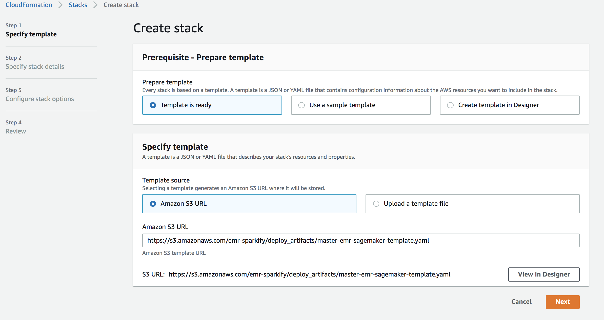

Click Next. 

In `Step 2 Specify stack details` and specify a VPC to deploy the EMR cluster and SageMaker notebook instance.

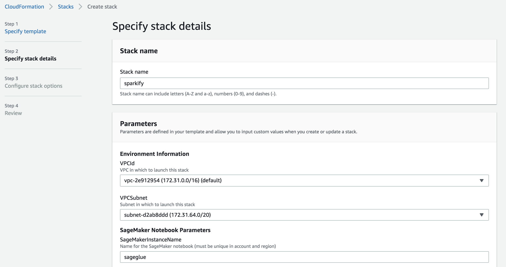

Be careful which instance you'd like to deploy (you are going to be [charged per second depending on the instance](https://aws.amazon.com/ec2/pricing/on-demand/)):

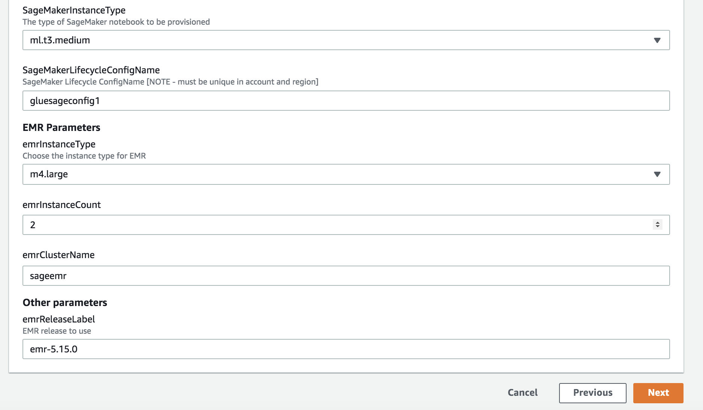

In `Step 3 Configure stack options` just leave the default and click Next.

In `Step 4 Review` scroll down.

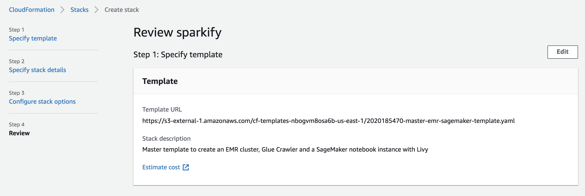

And click on the checkboxes, `I acknoledge...`, `I acknoledge...`. This gives permissions for CloudFormation to create policies e permissions for our stack to be provisioned in AWS.

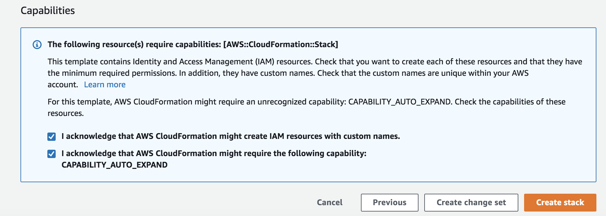

The master template will start provisioning resources. First it will configure an EMR cluster (for obtaining the master node IP). Then a third stack with the SageMaker notebook instance will be deployed (configuring Livy and communication with the EMR master node):

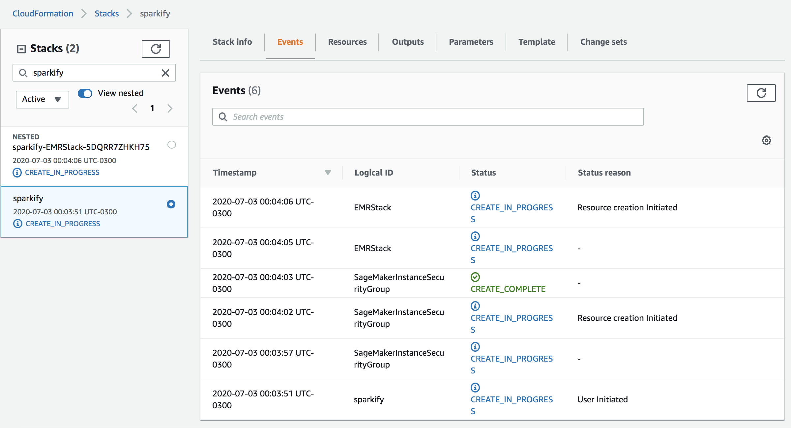

Wait a few minutes and all the resources should be provisioned and configured:

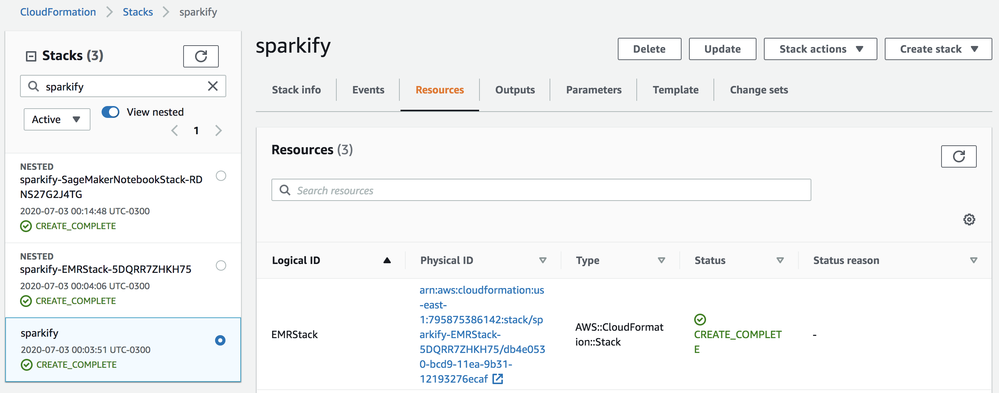

Go to the EMR service. The EMR cluster should be up and running, with the configuration you provided in the Stack (default is 1 m4.large for master node and 2 m4.large for core nodes):

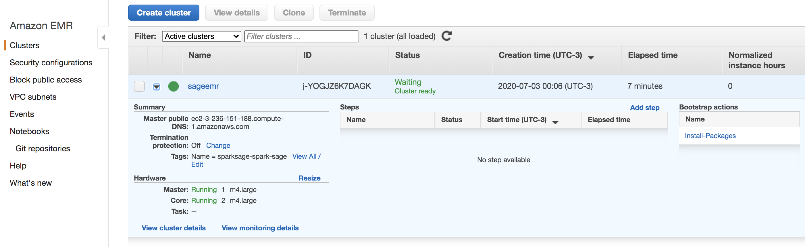

Go to the SageMaker service. There should be an Notebook instance provisioned and running:
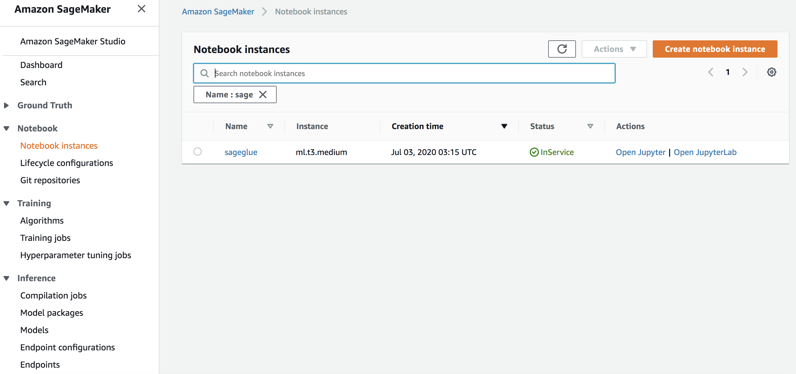

Click on `Open Jupyter Lab`. This GitHub repository should be configured in the notebook instance (folder called `projects`):

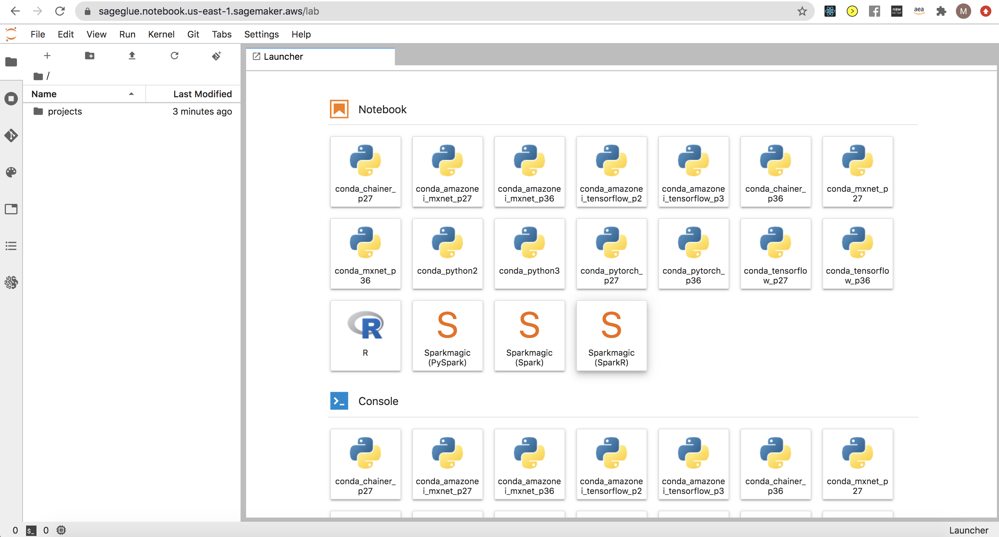

Open the notebook in `projects/spark-churn/Sparkify-cluster.ipynb`. To check if connection with the EMR cluster is working use the magic command `%help`. All the options for Livy will be shown, indicating how to send commands to the Spark cluster and how to load a Spark DataFrame locally as a Pandas DataFrame (with `spark -o df`):

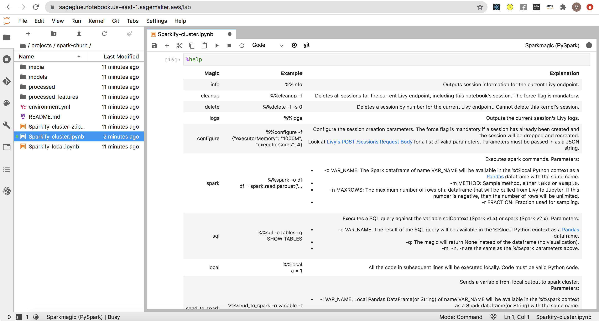

Let's execute the cell to load data from S3, using the EMR cluster. The SageMaker notebook instance will send a command to the EMR Spark cluster and the cluster will do the heavy lifting of loading into the cluster:

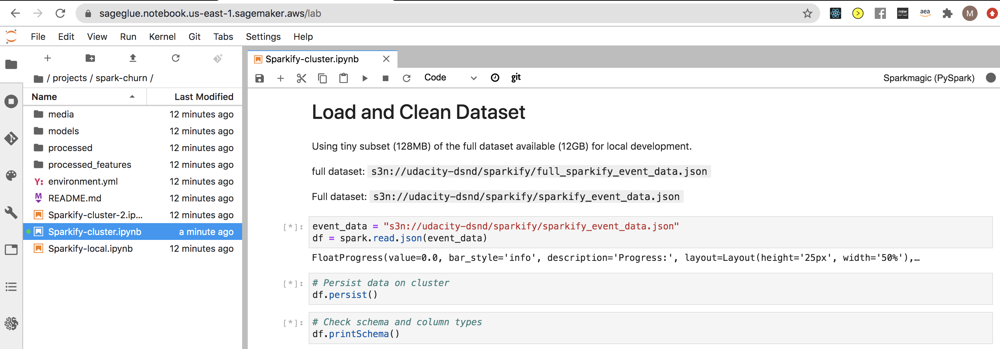

If we go back to the EMR service and see cluster Monitoring metrics by selecting our cluster, clicking on `Monitoring` and on the `IO` tab, we can see that the metric `Memory available MB` is decreasing since Spark is loading the data into memory and disk ([the default behavior of `df.persist()`](http://spark.apache.org/docs/latest/api/python/pyspark.sql.html?highlight=persist)):

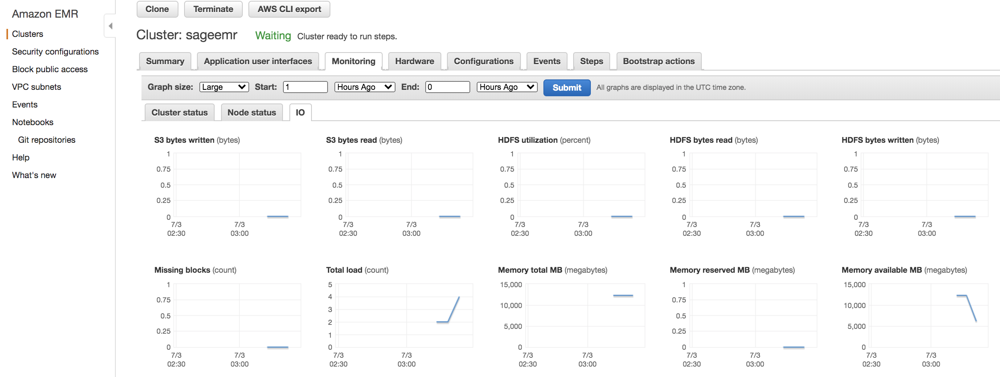

In the Jupyter notebook we see that the Spark cluster has loaded the data and had communicated back to the notebook (showing the Schema in the cell):

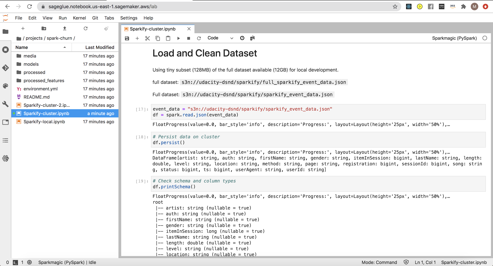

Feel free to explore the notebooks and data!

## Remember - Delete AWS resources
To delete the created resources (and avoid unnecessary costs) in AWS just go back to your `master` CloudFormation stack and delete it:

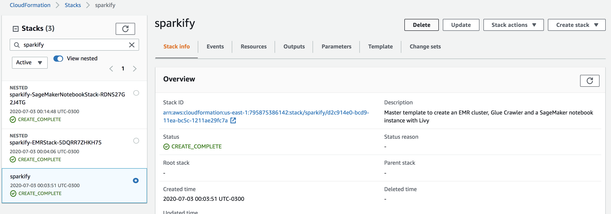

Click on Delete stack:

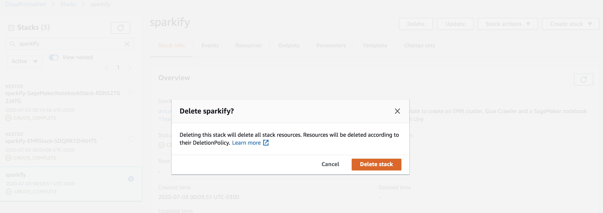

It'll delete all created resources with the master CloudFormation template:

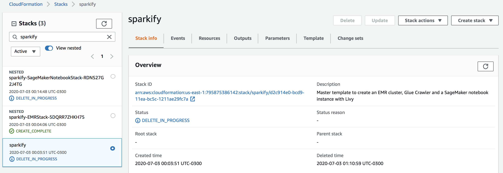

## Costs for running app

The costs are described in [EMR pricing](https://aws.amazon.com/emr/pricing/), [SageMaker pricing](https://aws.amazon.com/sagemaker/pricing/), [S3 pricing](https://aws.amazon.com/s3/pricing/) and [Free tier](https://aws.amazon.com/free). 

For the default configurations showed the cost will be ~0.15 USD/hour.

## Possible improvements (out of the scope of this project)

- add new features <a href="#possible-features">related to other time aggregations (e.g. weeks)</a>, related to the phase (if they are paid user, free, etc.), better process user-agent data, etc.
- deal with class imbalance (with some downsampling, oversampling methods or with some technique for generating synthethic data like <a href="https://arxiv.org/pdf/1106.1813.pdf">SMOTE</a>)
- analyze correlations of computed feature for elimination (although ensembles of trees models help with that, it would be a lot beneficial since we ended up with hundreds of features)
- try other models
- transform in transient EMR cluster (for batch inferences, and batch feature calculations), shutting down cluster after training and inference
- use spot instances in EMR cluster for cost opmitization
- improve performance by converting json to Parquet, compression, partitioning in S3
- adjust number of instances and types in EMR, analyse performance in Spark UI, etc.
- generate inferenced in realtime (a lot more complex: feature store for calculating and updating features, turn training model into an rest API with MLeap, etc.)
- add <a href="https://airflow.apache.org/">AirFlow</a>, <a href="https://aws.amazon.com/pt/step-functions/">AWS Step Functions</a> for orchestration, automating the calculatation features and performing inferences
- trigger marketing campaings, promotions, incentives for user to use the app (personalized e-mails, SMSs), etc.