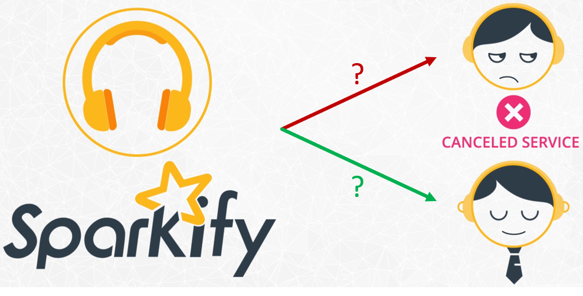
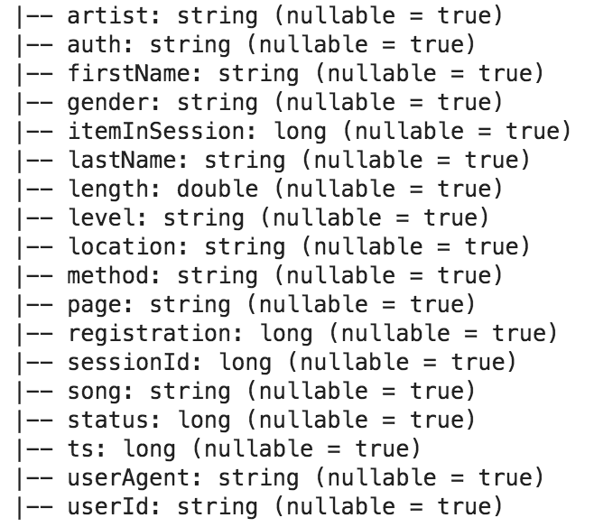

# Udacity's Sparkify Capstone Project
## Introduction

In this project a classification model is developed to predict whether a customer will churn.

Sparkify is a fictitious music streaming service with lots of users. Users can play their favorite songs, create playlist, add friends, like/dislike songe, amoung other actions and the service has a free tier that plays advertisements and a premium tier which offers additional functionalities and is ad-free. Users can upgrade or downgrade their subscription plan any time, but also cancel it.

We want our model to predict if a customer will churn so that the company can act in advance and avoid losing customers. The data provided is from interactions that users have with the Sparkify app, containing multiple information, from like which action the user has performed (play song, add friend, cancel plan, go to home page, which song was listened, which artist, which device he/she is using the app, etc.).

Two datasets were available, one tiny subset (128MB) for local development and another full dataset (12GB).

The locations of the datasets were:

- Mini dataset: 

`s3n://udacity-dsnd/sparkify/mini_sparkify_event_data.json`

- Full dataset: 

`s3n://udacity-dsnd/sparkify/sparkify_event_data.json`

An overview of the schema of the dataset:

An observation is that no explanation of the schema was given. However by the name of the columns and the data we can infer their meaning:

- userId (string): user identifier
- firstName (string): user’s first name
- lastName (string): user’s last name
- gender (string): user’s gender (M and F)
- location (string): user’s location
- userAgent (string): agent used by the user to access the streaming service
- registration (int): user’s registration timestamp
- level (string): subscription level(free and paid)
- ts (int): timestamp of a given log
- page (string): type of interaction (NextSong, Login, Home, Cancellation Confirmation, etc.)
- auth (string): authentication level;(Logged In, Logged Out, Cancelled, Guest)
- sessionId (int): usersession to which the log belongs to
- itemInSession (int): log count in a given session
- method (string): HTTP request method (GET and PUT)
- status (int): HTTP status code (200, 307 and 404)
- song (string): song name
- artist (string): artist name
- length (double): song’s length in seconds

## Project Structure
The project is divided into the following tasks:

I. Loading and Cleaning the Dataset

II. Exploratory Data Analysis

III. Feature Engineering

IV. Modeling

V. Evaluating Results

VI. Deploying

The final churn prediction model was developed using ensembles of models ()

For more information on the local development: [see local development notebook](./Sparkify-local.ipynb)

For more information on the development with a Spark cluster running on EMR: [see cluster development notebook](./Sparkify-cluster.ipynb)

## Possible improvements (out of the scope of this project)

- add new features <a href="#possible-features">related to other time aggregations (e.g. weeks)</a>, related to the phase (if they are paid user, free, etc.), better process user-agent data, etc.
- deal with class imbalance (with some downsampling, oversampling methods or with some technique for generating synthethic data like <a href="https://arxiv.org/pdf/1106.1813.pdf">SMOTE</a>)
- analyze correlations of computed feature for elimination (although ensembles of trees models help with that, it would be a lot beneficial since we ended up with hundreds of features)
- try other models
- transform in transient EMR cluster (for batch inferences, and batch feature calculations), shutting down cluster after training and inference
- use spot instances in EMR cluster for cost opmitization
- improve performance by converting json to Parquet, compression, partitioning in S3
- adjust number of instances and types in EMR, analyse performance in Spark UI, etc.
- generate inferenced in realtime (a lot more complex: feature store for calculating and updating features, turn training model into an rest API with MLeap, etc.)
- add <a href="https://airflow.apache.org/">AirFlow</a>, <a href="https://aws.amazon.com/pt/step-functions/">AWS Step Functions</a> for orchestration, automating the calculatation features and performing inferences
- trigger marketing campaings, promotions, incentives for user to use the app (personalized e-mails, SMSs), etc.